# Preface

This is the *story* of the project, meant to be read cover to cover. It starts from nothing — a pile
of raw sales receipts — and walks every step to the finish: a handful of customer groups, each with a
predicted future value and a clear marketing action. Along the way you'll see the **actual figures**
we produced, the **formulas** behind each method, the **reasoning** for every decision, and a
**checkpoint** after each chapter telling you exactly what we have so far.

No prior data-science knowledge is assumed. Where a concept appears for the first time, it's explained
in plain English before the maths. The recurring theme — the thing that makes this more than a button
press — is **honesty**: at every step we *validate* what we found, *compare* alternatives, and *admit*
what the data couldn't support.

> **The whole journey on one line:** clean a million transactions → describe each customer with a few
> numbers → group similar customers → predict each one's future value → name the groups, prove they're
> real, and decide what to do with each.

---

# Chapter 1 — The Question and the Data

A UK online gift shop has two years of sales and a limited marketing budget. Right now every customer
is treated the same. That's wasteful: a loyal big spender and a one-time bargain hunter shouldn't get
the same email. **We want to split customers into a few meaningful groups, predict who will be
valuable, and spend the budget where the money actually is.**

The raw material is the public **"Online Retail II"** dataset — about **1.07 million** transaction
lines, ~5,900 customers, a gift-ware retailer, December 2009 to December 2011. Real data is messy, and
this is no exception:

- **22.8%** of rows have *no* Customer ID — we can't tie them to a person.
- ~**19,000** rows are **cancellations** (the invoice number starts with "C").
- Many rows are **returns** (negative quantities) or **non-products** (postage, fees, gift cards).

A crucial design choice up front: we will build **two separate models** — one that groups customers by
*behaviour* (clustering), and one that predicts *future value* (CLV) — and only join them at the very
end. Why separate? Because if "value" helped *define* the groups, we could never honestly say "this
behaviour group *turns out* to be the most valuable." Keeping them apart also buys a free check: if two
independent models agree on who's valuable, that's strong evidence both are right.

> 📍 **Checkpoint.** We have a question (*who's valuable and what do we do about them?*), a messy
> 1.07M-row dataset, and a plan: clean → features → (cluster ∥ value) → act.

---

# Chapter 2 — Cleaning: One Trustworthy Row at a Time

Before we can ask "how much does each customer buy?", every row must be real and attributable. Cleaning
is not janitorial work — it's a series of *modelling decisions*, each with consequences.

We made these calls (and recorded the reasoning in the design docs):

- **Drop rows with no Customer ID** — unattributable.
- **Cancellations and returns:** remove them from purchase counts, but **keep a return-rate** as a
  separate signal (a returns-heavy customer is meaningful, and we don't want to lose that).
- **Remove non-products** (postage, bank charges, adjustments, gift cards) so that "Monetary" means
  genuine *product* spend.

After cleaning we had **790,704 clean transaction lines and 5,852 customers** — and, importantly, the
money still balanced. We always *prove* cleaning didn't silently lose revenue with a reconciliation:

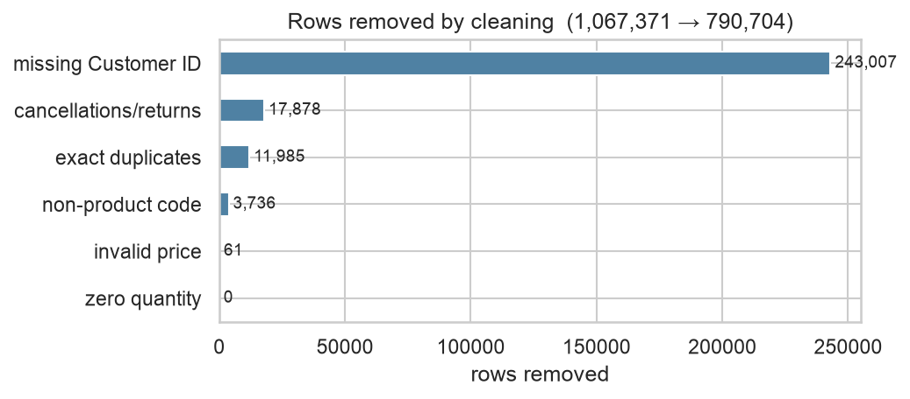{width=6in}

> 📍 **Checkpoint.** A clean transaction table: **790,704 rows, 5,852 customers**, books balanced.
> Already a hint of trouble ahead — about **28%** of customers bought only once.

---

# Chapter 3 — Exploring: Letting the Data Set the Rules

Before modelling, we *look*. Exploratory analysis is where later decisions get *justified by evidence*
rather than assumed. Four findings shaped everything downstream.

**1) Value is wildly concentrated (the Pareto effect).** The top 20% of customers drive about **77% of
revenue**. This single fact later tells us to budget by *value*, not by headcount.

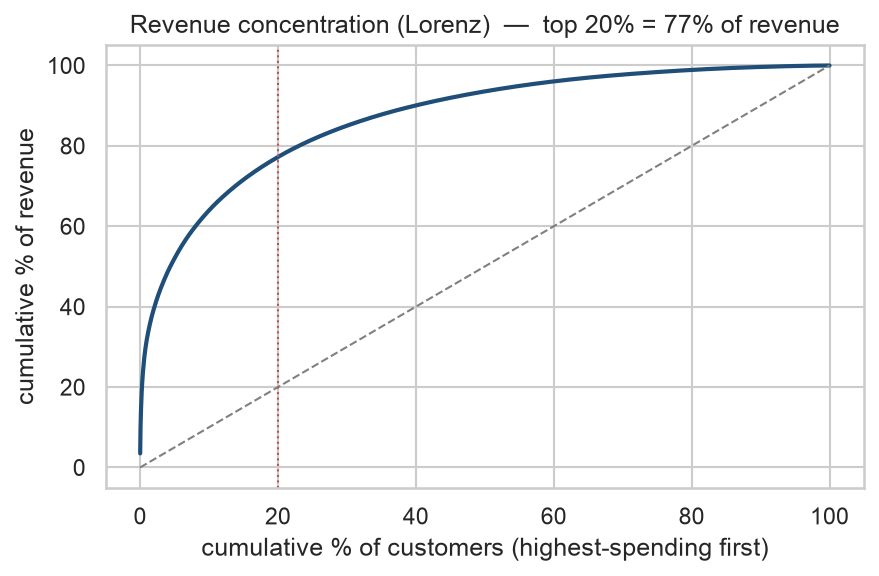{width=5.5in}

**2) Spend is heavily right-skewed.** Most customers spend modestly; a few spend enormously — like
incomes, where the average is dragged far above the typical person. This is why we later prefer the
**median** (the typical customer) and apply a **logarithm** to tame the long tail.

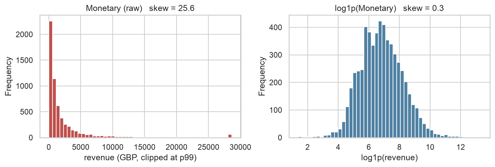{width=5.5in}

**3) There is strong seasonality.** Being a gift retailer, sales spike before Christmas. This will come
back to haunt the value model in Chapter 6 (which assumes a *constant* buying rate).

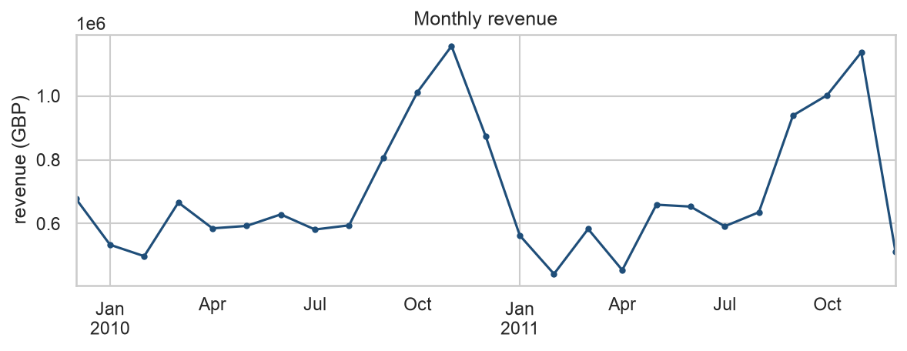{width=5.5in}

**4) ~28% of customers bought only once.** A large, distinctive group we'll have to handle specially.

> 📍 **Checkpoint.** We understand the data's shape: concentrated value (top 20% = 77% revenue),
> heavy skew (→ use median + log), Christmas seasonality (→ a known risk), and a big one-timer block.

---

# Chapter 4 — Features: From Receipts to a Customer's Fingerprint

Models need **one row per customer**, but the data is one row per *sale*. Feature engineering collapses
each customer's many transactions into a few descriptive numbers. The guiding rule: *the columns are
the problem* — every feature must trace to a justified column.

We built the classic **RFM + Tenure** fingerprint:

- **Recency** — days since their last purchase (low = recently active).
- **Frequency** — how many separate purchases.
- **Monetary** — total spend.
- **Tenure** — days since their *first* purchase (how long they've been a customer).

Two treatment decisions, both made *from the data*:

- **Log, then scale.** The skew (Chapter 3) means a few whales would dominate any distance calculation.
  A $\log(1+x)$ transform compresses the tail; scaling then puts features on a comparable range. We
  *measured* the skew and only logged the columns that needed it (Frequency and Monetary).

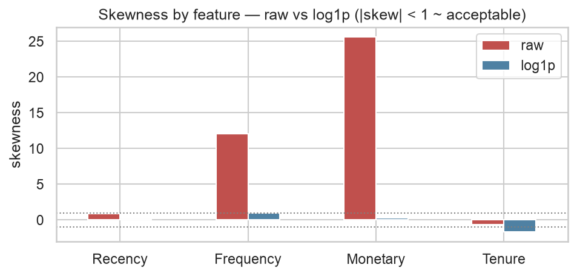{width=5.5in}

- **Drop AvgBasket from clustering.** Average basket value is exactly Monetary ÷ Frequency, so feeding
  it alongside them adds *zero new information* — a redundancy, visible in the correlation map.

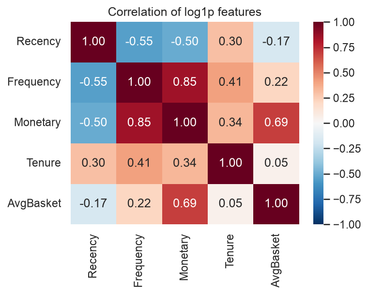{width=4.6in}

### A discovery hiding in the one-timers

Here the data revealed something elegant. For a one-time buyer, the first purchase *is* the last
purchase — so **Recency = Tenure exactly**, and **Frequency is always 1**. Two of their four features
carry no independent information. Mathematically, their feature covariance matrix is **rank 2, not 4** —
they collapse onto a flat 2-D sliver of the 4-D space. We proved it numerically:

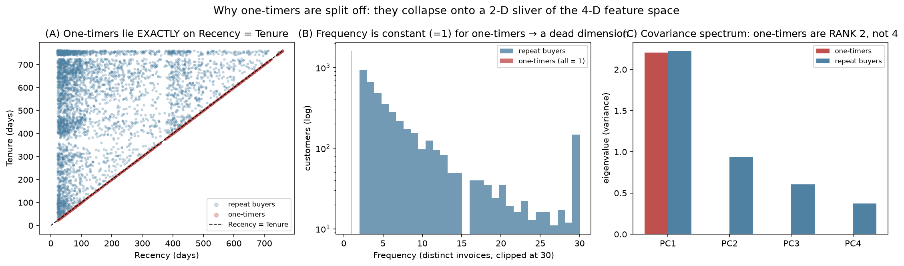{width=6.5in}

This is *why*, in the next chapter, one-timers are set aside and handled as their own group rather than
forced through clustering.

> 📍 **Checkpoint.** Each customer is now a point in 4-D space (scaled R/F/M/Tenure) plus separate
> value inputs and supporting variables. And we know one-timers are a degenerate special case.

---

# Chapter 5 — Clustering: Finding the Groups

**What clustering is.** It automatically sorts items into groups so that members of a group are similar
and different groups are dissimilar — *without being told the groups in advance*. Think of sorting
laundry into darks/lights/colours, but in four dimensions and by algorithm.

We used **three** different methods on purpose. Each makes a different assumption, so when they *agree*,
the structure is probably real; when they *disagree*, that itself is a finding.

### Method 1 — K-Means (the workhorse)

K-Means picks $K$ "average customers" (centroids) and assigns everyone to the nearest, then repeats
*assign → move centroid* until nothing changes. It minimises the **within-cluster sum of squares**:

$$ J \;=\; \sum_{k=1}^{K}\ \sum_{x\in C_k}\ \lVert x-\mu_k\rVert^2, \qquad \mu_k=\frac{1}{|C_k|}\sum_{x\in C_k}x .$$

Watching it run makes it click — the centroids slide into place and the total tightness $J$ drops every
step until it converges:

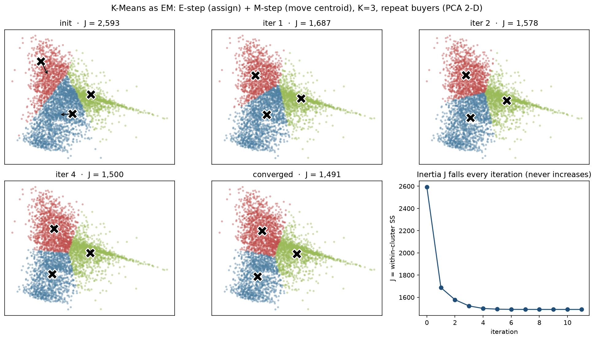{width=6.5in}

### Method 2 — Gaussian Mixture (the soft, oval version)

A Gaussian Mixture says each customer is a *blend* of $K$ "types," and the types can be stretched,
tilted ovals rather than circles:

$$ p(x) \;=\; \sum_{k=1}^{K} \pi_k\,\mathcal{N}(x\mid \mu_k,\Sigma_k), \qquad \sum_k \pi_k = 1 .$$

It is fit by the **EM algorithm**, alternating between computing each point's soft membership and
re-estimating the ovals. Watching the ovals tilt and the points shade by membership:

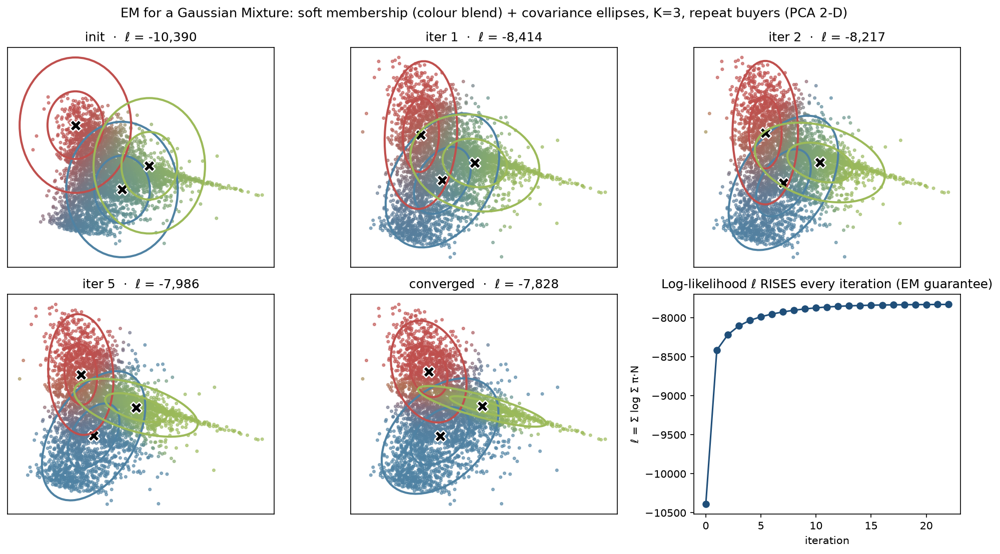{width=6.5in}

(The third method, **Ward hierarchical clustering**, builds a merge-tree you cut at $K$ — useful for a
visual narrative.)

### Choosing K — the heart of the rigour

Nobody tells us how many groups exist, and "more clusters" *always* looks tighter, so we can't simply
minimise tightness. We **triangulate** several imperfect signals that fail in *different* ways:

- **Silhouette** — for each point, how much closer it is to its own group than the nearest other:
  $\;s(i)=\dfrac{b(i)-a(i)}{\max(a(i),b(i))}$. Higher is better.
- **Gap statistic** — compares our tightness against *random* data; uniquely it can say "K = 1, no real
  clusters": $\;\mathrm{Gap}(k)=\mathbb{E}_{\text{null}}[\log W_k] - \log W_k$.
- **Elbow, Calinski–Harabasz, Davies–Bouldin** — corroborating internal scores.

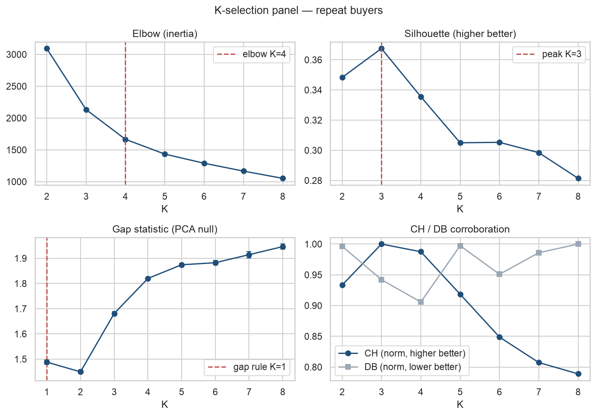{width=6.5in}

Internal scores only say "how many blobs." The decisive test is **stability**: re-cluster on random 80%
subsamples and ask whether the same groups reappear. *Real structure reproduces; artefacts dissolve.*
We measured each cluster's survival with the Jaccard overlap $J(A,B)=\frac{|A\cap B|}{|A\cup B|}$, and
K=3 was the most stable.

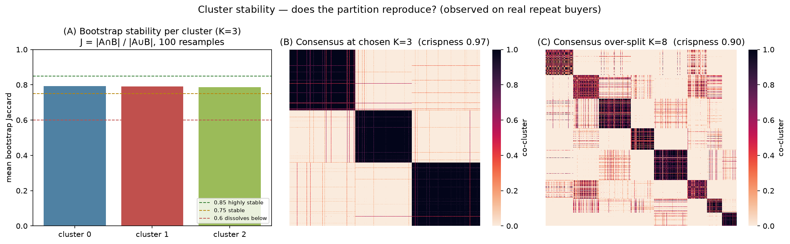{width=6.5in}

**The verdict:** **K = 3** for the repeat buyers — silhouette and CH peak there and it is the most
stable. The one-timers (degenerate, Chapter 4) are set aside as their own group, giving **4 segments
in total**. Clustering *everyone* actually scored a higher silhouette, but only because the easy
one-timer blob inflated it — a trap, not a better answer.

### Do the methods agree?

We compared the three methods' groupings with the **Adjusted Rand Index** (1 = identical, 0 = chance).
They agree only *moderately* (K-Means ↔ Ward ≈ 0.61; the soft GMM diverges more).

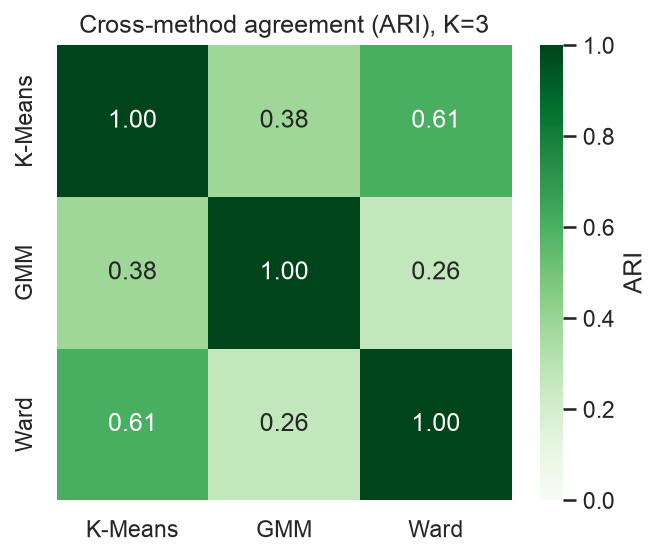{width=4.6in}

That moderate agreement is not a failure — it is the **most important honest finding of the project**:
customer behaviour is a **continuum**, not crisp islands. We therefore deploy K-Means and call the
result a *useful discretisation*, not "natural kinds."

> 📍 **Checkpoint.** **4 segments** (3 repeat-buyer clusters + one-timers), chosen by triangulation and
> proven stable — with the honest caveat that the data is a gradient, not natural groups.

---

# Chapter 6 — Customer Lifetime Value: Predicting the Future

Grouping tells us *who's who today*. The second track predicts *who will be worth what tomorrow*.

**The hard part:** online retail is *non-contractual* — customers never announce they've left, they
just go quiet. So "is this dormant customer gone, or just resting?" is a *probability* we must infer.
And naive CLV ("sum their past spend") is backward-looking; it can't tell a loyal-but-dormant customer
from a dead one. We need a *forward-looking, probabilistic* forecast, split into two questions:

$$ \text{CLV} \;=\; \underbrace{\mathbb{E}[\text{future purchases}]}_{\text{BG/NBD}} \;\times\; \underbrace{\mathbb{E}[\text{value per purchase}]}_{\text{Gamma-Gamma}} .$$

### Part A — How many future purchases? (BG/NBD)

Each customer has two hidden habits: while *active* they buy at random at their own rate $\lambda$; and
after each purchase they may quietly retire forever with probability $p$. Across the population these
rates vary:

$$ \lambda \sim \mathrm{Gamma}(r,\alpha), \qquad p \sim \mathrm{Beta}(a,b) .$$

The model learns the four numbers $(r,\alpha,a,b)$ from everyone's history, then for each person asks:
*given how they've behaved, are they probably still active?* The beautiful consequence — **recency
drives churn, not raw frequency**: a *frequent* buyer going quiet is alarming (low P(alive)); a
naturally *rare* buyer going quiet is normal (high P(alive)). One picture shows the whole logic:

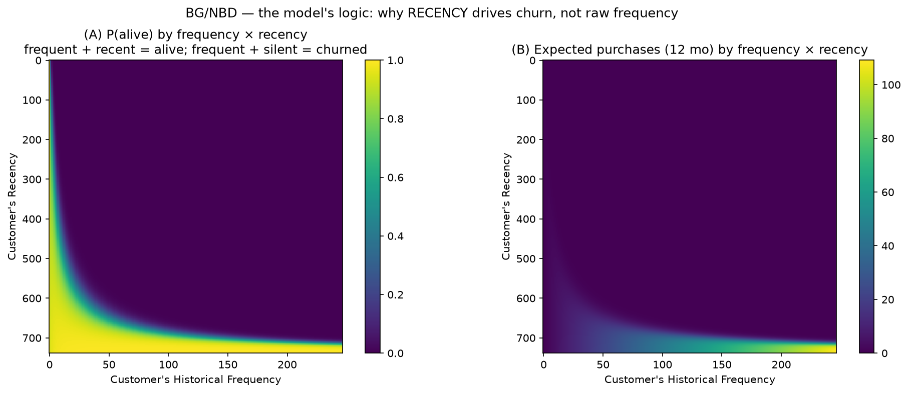{width=6.5in}

### Part B — How much per purchase? (Gamma-Gamma, with shrinkage)

We estimate each customer's average order value — but *without over-trusting thin evidence*. One £900
order doesn't make someone a "£900 customer." So the estimate is **shrunk** toward the population mean,
weighted by how much data we have:

$$ \hat{s}_i \;\approx\; \frac{n_i\,\bar m_i \;+\; k\,\bar m_{\text{pop}}}{n_i + k}, \qquad n_i=\text{number of purchases}. $$

Many purchases → trust their own average; few → lean on the crowd. You can *see* the shrinkage —
low-evidence customers are pulled toward the population mean line:

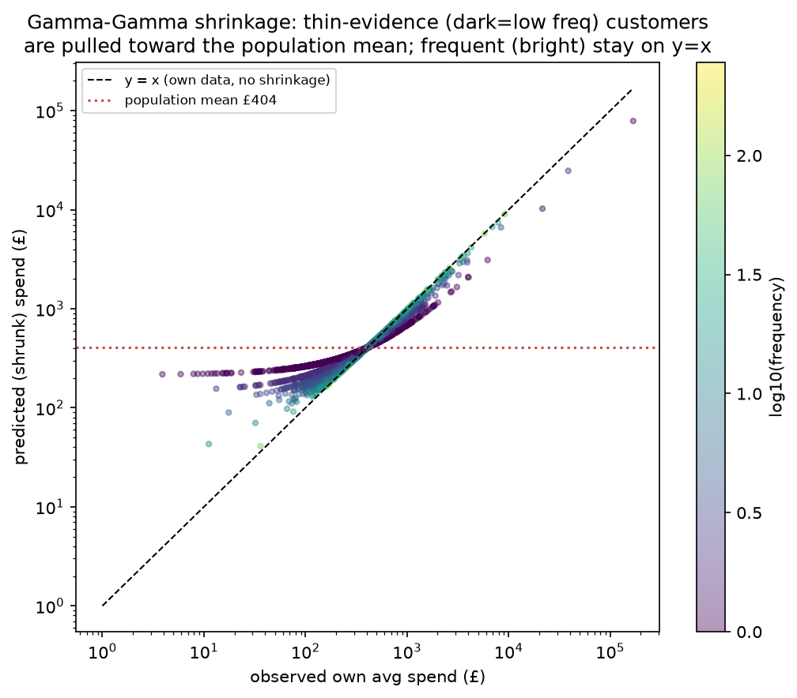{width=5.5in}

Multiplying the two halves gives each customer's predicted CLV:

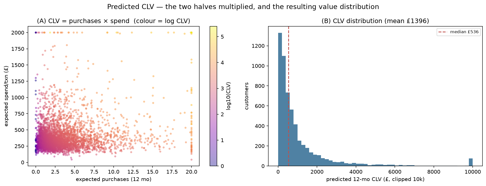{width=6.5in}

### Does it actually predict the future?

To trust a forecast, hide the future and check the guess. We split the timeline — fit on the past,
predict the next 3/6/9 months, compare to what *actually* happened. The model's **ranking** is
excellent (predicted tracks actual across customer groups), but there is a vertical bias on short
windows:

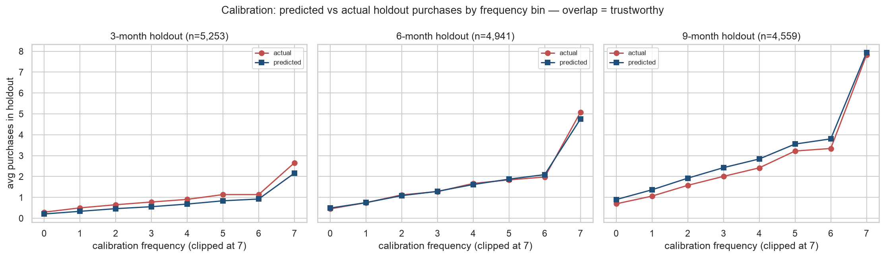{width=6.5in}

**The honest finding:** that bias is **seasonality**. BG/NBD assumes a constant buying rate, but this
is gift-ware with a Christmas peak; a 3-month window ending in December is under-predicted. Over a full
12-month cycle it averages out — so the deliverable horizon is fit for purpose, and we *named* the
limitation rather than hiding it.

### Confidence: two kinds of uncertainty

We fit the final model with **MCMC** (which explores the whole range of plausible settings, not just
the single best guess), giving every prediction a credible interval. A subtle but important
distinction we were careful to separate:

- **Estimation uncertainty** — how sure we are of a customer's *expected* value. With ~5,900 customers
  this is **tight** (±~2%), so our *ranking* is confident.
- **Predictive uncertainty** — how much an *individual* will *actually* spend. This is **wide**
  (±50–150%) and correctly shrinks as we gather more data on a customer.

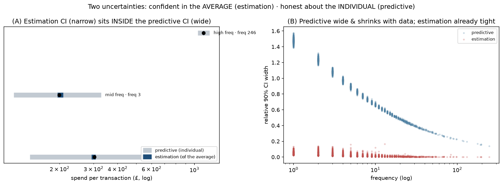{width=6.5in}

> 📍 **Checkpoint.** Every customer now carries a predicted **12-month CLV** and a **P(alive)**, each
> with uncertainty — validated as a trustworthy *ranking*, with the seasonality caveat stated.

---

# Chapter 7 — Personas, Proof, and Actions

Now the two tracks meet. We join each customer's **segment** to their **CLV** and turn labels into a
business answer.

### Naming the segments (from evidence, not a textbook)

A cluster labelled "0/1/2" means nothing until described. We profiled each group in *raw* units
(medians) and named it from its actual signature. Four clear personas emerged:

| Persona | Signature | Revenue now | Future value |
|---|---|---:|---:|
| **Champions** | recent · frequent · high-spend · long-tenured | **80.7%** | **71.7%** |
| **Rising** | recent · *newest* · growing | 7.9% | **16.4%** |
| **At-Risk** | established but lapsed ~1 year · P(alive) fallen | 8.1% | 5.7% |
| **One-Timers** | single purchase · low value | 3.2% | 6.2% |

The "snake plot" shows each segment's distinct shape, and the bars show the strategic signal — value
*now* versus value in the *future*:

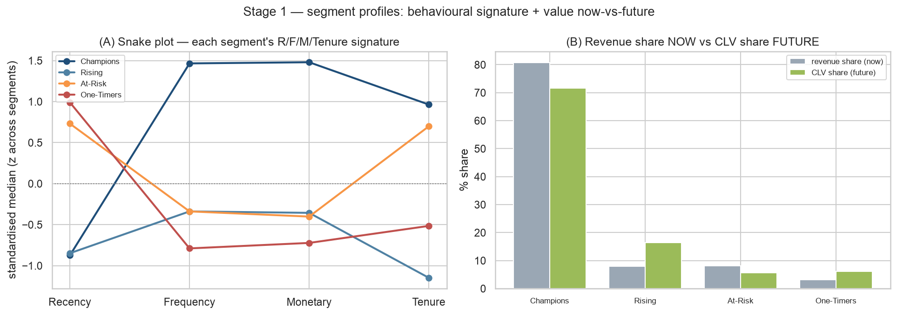{width=6.5in}

### Proving the segments are real (not just lines we drew)

Testing whether segments differ on the features we *clustered on* is circular. The real proof comes
from variables the clustering **never saw**. We used effect sizes (not p-values — at ~5,900 customers
*everything* is "statistically significant," so size is what matters):

$$ \eta^2_H \;=\; \frac{H-k+1}{N-k}\ \in[0,1]. $$

The gold-standard result: the segments differ **strongly on predicted CLV** ($\eta^2 \approx 0.62$) —
a variable built by an entirely separate model. Two independent methods agreeing on "who's valuable"
is powerful evidence the groups are real. We also reported the honest **null**: geography barely
differs (the shop is 84% UK).

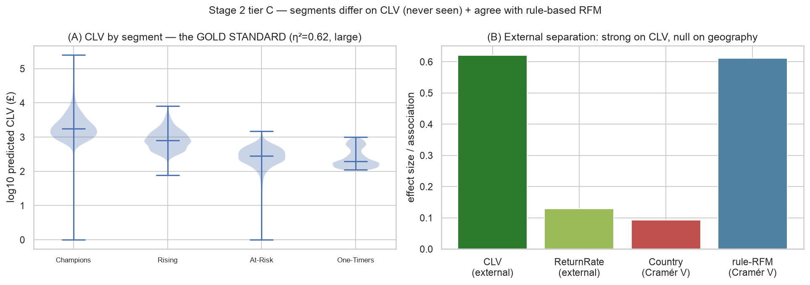{width=6.5in}

### The action grid (spend where the money is)

One segment, one clear action. And crucially — **budget follows value at stake, not headcount.** The
segments are roughly equal in size (21–28% each), but Champions hold ~80% of the value; spending
equally would be a serious mistake.

| Persona | Action | Why |
|---|---|---|
| **Champions** | **Protect** | retain, VIP, don't discount — they'd buy anyway |
| **Rising** | **Grow** | nurture the newest high-potential into Champions |
| **At-Risk** | **Win-back** | reactivate the *high-CLV* lapsers first |
| **One-Timers** | **Convert** | cheap second-purchase nudge, don't overspend |

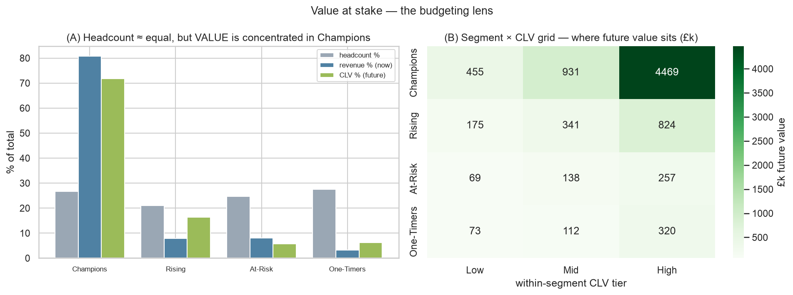{width=6.5in}

Within each segment, a customer's CLV tier sets the *intensity* — a high-value At-Risk customer is the
single best place to spend a retention pound; a low-value one is not worth chasing.

> 📍 **Checkpoint — the finish line.** A per-customer table mapping **every customer → persona +
> predicted CLV + recommended action**, with the segments *proven* to differ on independently-modelled
> value.

---

# Chapter 8 — What This Story Was Really About

If you remember one thing, make it this: **the value was never the clusters — it was the judgement.**

1. **We validated, we didn't just produce.** Anyone can call `KMeans()`. We proved the result
   reproduces (stability) and is real (an external variable).
2. **We compared methods.** Agreement across differently-biased methods is evidence; their
   disagreement told us the data is a continuum.
3. **We admitted the continuum.** There were no crisp natural groups — and choosing a *useful*
   discretisation anyway, openly, is the mature move.
4. **We surfaced every limitation:** the one-timer degeneracy, the CLV seasonality, the
   estimation-vs-predictive uncertainty, the geography null — all named, none buried.
5. **We chose honesty over flash.** "Three robust segments plus one-timers that differ on CLV — here
   is each profile, action, and value at stake" is the *successful* result.

**The one-sentence summary:** *We cleaned a million messy transactions, described customers by their
behaviour, predicted each one's future value with honest uncertainty, proved the groups were real by an
independent measure, and turned it all into who-to-spend-on — admitting at every step that the data is
a continuum, not neat boxes.*

---

*Companion materials: the `TEACHING_HANDBOOK` (instructor's guide), the two mathematics references in
`planning/docs/`, and the full code in `src/` and `notebooks/`. Project repository:
github.com/SajalHRX/customer-segmentation. Author: Sajal Singhal — MSc Statistics portfolio project.*
