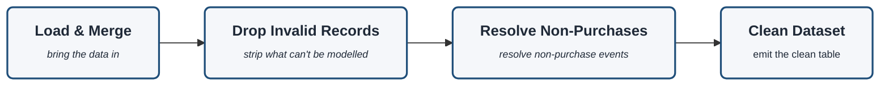

# Data Cleaning (Pre-processing detail)

Zoom-in on the **Pre-processing** stage of `project-architecture.md`. The decisions behind each
node are recorded in `planning/docs/16_Data_Cleaning_Decisions.docx`.

> Rendered with `securityLevel: loose` + `htmlLabels: true` (see `/tmp/mermaid-config.json`) so the
> bold title vs. light italic descriptor styling applies.

## What each node does

| Node | Encodes (locked decisions) |
|---|---|
| **Load & Merge** | concatenate the two yearly sheets (2009-10 + 2010-11) into one transaction table; drop exact cross-sheet duplicates |
| **Drop Invalid Records** | drop: missing Customer ID · non-product StockCodes (POST/DOT/fees/adjust/test — **postage excluded**) · Price ≤ 0 · Quantity = 0 · exact duplicate rows |
| **Resolve Non-Purchases** | remove cancellations (`C`-invoices) + negative-quantity returns from the modelling table (**DROP**, not net) — **but capture the return/cancellation signal first** for the per-customer return-rate (a supporting/validation variable) |
| **Clean Dataset** | emit the clean transaction table (completed purchases only) + a **row-count reconciliation** |

> **Note — wholesaler flagging is NOT here.** It is a *customer-level* derived attribute, so it
> lives in **feature engineering** as a *supporting variable* (never a clustering input). See doc 16.

> **Ordering note.** "Resolve Non-Purchases" must **extract the return-rate before removing** those
> rows — they feed a tier-2 external-validation variable (doc 13), so they are recorded, not silently dropped.
