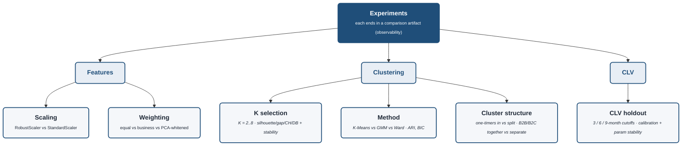

# Experiment Map (observability)

Every "try N variants and compare" point in the project, grouped by stage. The standing rule
([[feedback-experiment-observability]]): **each experiment ends in a comparison artifact** (a table
or plot) — never a silent pick. This map is the catalog so no experiment gets dropped.

> Rendered with `securityLevel: loose` + `htmlLabels: true` for the bold-title / italic-descriptor styling.

## The catalog

| Experiment | Variants | Compared on | Stage | Doc |
|---|---|---|---|---|
| **Feature scaling** | RobustScaler vs StandardScaler | segment stability / ARI | Features | 09 |
| **Feature weighting** | equal vs business-weighted vs PCA-whitened | segments + metrics | Features | 09 |
| **K selection** | K = 2…8 | silhouette / gap / CH / DB + stability | Clustering | 10 |
| **Clustering method** | K-Means vs GMM vs Ward | cross-method ARI, BIC | Clustering | 11 |
| **Cluster structure** | one-timers in vs split-off; B2B/B2C together vs separate | EDA-driven | Clustering | 16, 17 |
| **CLV holdout** | 3 / 6 / 9-month cutoffs | calibration + parameter stability | Validation | 08 |

(Sub-experiments folded into the above: GMM `covariance_type` via BIC; hierarchical linkage = Ward.)
