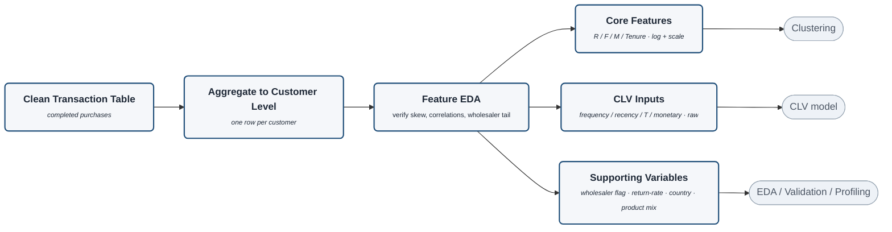

# Feature Engineering (detail)

Zoom-in on the **Feature Engineering** stage of `project-architecture.md`. Decisions recorded in
`planning/docs/17_Feature_Engineering.docx`. The clean transactions are rolled up to one row per
customer, inspected (Feature EDA), then split into **three lanes** — only **Core** drives the
clustering (the core-vs-supporting principle, doc 16).

> Rendered with `securityLevel: loose` + `htmlLabels: true` for the bold-title / italic-descriptor styling.

## The three lanes

| Lane | Features | Goes to |
|---|---|---|
| **Core Features** | R / F / M / Tenure (AvgBasket profiling-only) → `log1p` + RobustScaler | **Clustering** |
| **CLV Inputs** | frequency=inv−1 / recency=t_x / T / monetary — **raw** | **CLV model** |
| **Supporting Variables** | wholesaler flag, return-rate, country, product mix | **EDA / Validation / Profiling** |

> **Feature EDA** is the checkpoint that *justifies* the transforms: it's where the RFM skew (→ `log1p`),
> the AvgBasket=M/F redundancy, and the wholesaler tail are confirmed before features are finalised.
