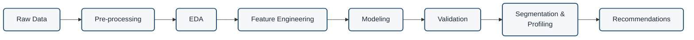

# Project Architecture (top-level pipeline)

The high-level pipeline: the major stages from raw transactions to marketing recommendations.
This is the *bird's-eye* view of the whole project — later diagrams zoom into specific stages
(the two-track modeling split, the cleaning logic, the validation flow).

## What each stage covers

| Stage | What it covers | Notebook | Planning docs |
|---|---|---|---|
| **Raw Data** | load the Online Retail II transactions (2 sheets, ~1.07M lines) | — | 03 |
| **Pre-processing** | cleaning: missing IDs, cancellations, returns, bad prices, duplicates | `01_cleaning` | 16 (pending) |
| **EDA** | understand the clean data: skew, revenue concentration, repeat rate, time & geography | `02_eda` | (pending) |
| **Feature Engineering** | collapse to one row per customer: RFM + tenure (clustering) and the CLV inputs | `03_features` | 04, 09 |
| **Modeling** | clustering (K-Means / GMM / Ward) **and** the probabilistic CLV model (BG/NBD + Gamma-Gamma) | `04_clustering`, `06_clv` | 11, 12, 15 |
| **Validation** | prove it is real: stability, separation, cross-method ARI, CLV temporal holdout | `05_validation` | 08, 10, 13 |
| **Segmentation & Profiling** | name the personas from their behavioural signature; profile in raw units | `07_segments_recommendations` | 13 |
| **Recommendations** | the segment x CLV action / value-at-stake grid | `07_segments_recommendations` | 14 |

> **Note:** EDA *observes* the data to inform decisions — it does not transform the table flowing
> down the pipeline. It is shown inline here for readability; its "observe and inform" nature is
> reflected in the detailed diagrams.
