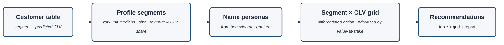

# Segments to Actions (detail)

Zoom-in on the **Segmentation & Profiling → Recommendations** stages of `project-architecture.md`.
Consumes the validated customer table (segment + CLV) and turns it into the business deliverable —
closing the loop back to the problem statement (spend follows expected return). Docs 13, 14, 12.

> Rendered with `securityLevel: loose` + `htmlLabels: true` for the bold-title / italic-descriptor styling.

## The flow

| Node | What happens | Doc |
|---|---|---|
| **Customer table** | the joined output: segment + predicted CLV per customer | 12 |
| **Profile segments** | describe each segment in raw units — medians, size, revenue & CLV share | 13 |
| **Name personas** | name from the behavioural signature (not imposed textbook labels) | 13 |
| **Segment × CLV grid** | cross lifecycle × value → one action per cell, ranked by **value-at-stake** | 12, 14 |
| **Recommendations** | the deliverable: final customer table + action grid + written report | 14 |

> **Value-at-stake** = how much revenue + predicted CLV is *on the line* for a segment/cell — the
> number that prioritises spend by money-on-the-line, not headcount (the high-CLV at-risk cell wins).
