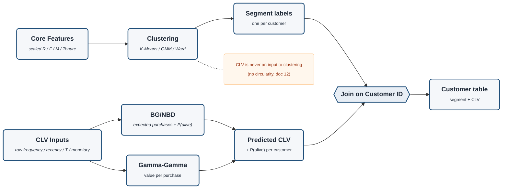

# Two-Track Modeling (detail)

Zoom-in on the **Modeling** stage of `project-architecture.md`. The key structural idea: clustering
and CLV are **two separate pipelines** on *different* representations of the same customers, meeting
only at the **join on Customer ID** — CLV **never** feeds back into clustering (no circularity, doc 12).
Decisions in `planning/docs/` 11 (methods), 12 (integration), 15 (CLV engine).

> Rendered with `securityLevel: loose` + `htmlLabels: true` for the bold-title / italic-descriptor styling.

## The two tracks

| Track | Input | Model | Output |
|---|---|---|---|
| **Clustering** | scaled Core Features | K-Means / GMM / Ward | segment label per customer |
| **CLV** | raw CLV Inputs | BG/NBD (purchases + P-alive) + Gamma-Gamma (value) | predicted CLV + P(alive) |

They run on **different representations** (scaled-log vs raw) and meet on **Customer ID** → the
final customer table carries **segment + CLV** together. Method *selection* and *validation* are the
next diagram (`validation-flow`).
