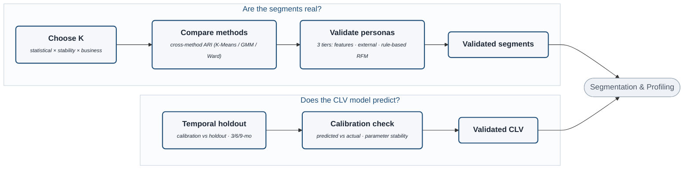

# Validation Flow (detail)

Zoom-in on the **Validation** stage of `project-architecture.md`. Validation proves *two* things, so
it has two lanes: **are the segments real?** (docs 10, 11, 13) and **does the CLV model predict?**
(doc 08). Both feed forward into Segmentation & Profiling. *(Note: "Choose K" is a bounded
sweep-score-decide step — fit + score clustering across K=2–8, then decide once; the downstream runs
once with the chosen K.)*

> Rendered with `securityLevel: loose` + `htmlLabels: true` for the bold-title / italic-descriptor styling.

## The two lanes

| Lane | Steps | Source |
|---|---|---|
| **Are the segments real?** | Choose K (3-leg) → Compare methods (ARI) → Validate personas (3 tiers) | docs 10, 11, 13 |
| **Does the CLV model predict?** | Temporal holdout (3/6/9-mo) → Calibration check | doc 08 |

Method *selection* lives here, not in `two-track-modeling`. The fuller sub-structure (the legs and
tiers) is in docs 10 and 13.
